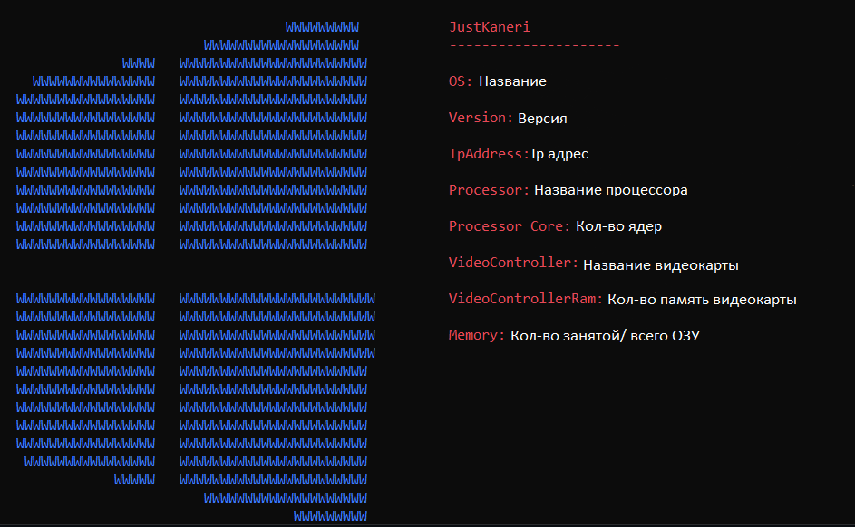

# Neofetch_Windows

# Утилита для просмтотра информации о системе

# Добавить команду "neofetch" в консоль
1. Выбрать место положение exe файла (путь не должен содержать русских символов)
2. Создать текстовый файл и указать в нем полный путь до exe файла (Например: D:\Neofetch_Windows.exe)
3. Сохранить этот файл в формате bat и с названием neofetch
4. Переместить данный файл в папку Windows\System32
5. В консоле написать neofetch
